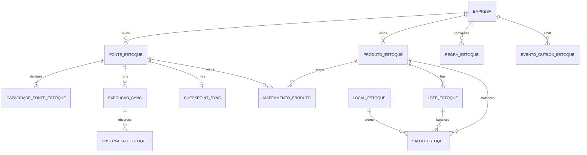

# Modelo canônico interno de estoque

CURRENT_STATE_AS_OF=2026-08-23T17:51:15Z
BASELINE_SHA=a5a280c3ebc54741ced02a77d4da5ec51834d583
ARCHITECTURE_VERSION=E1-v1.0
DOCUMENT_STATUS=FINAL

## Convenção

Os nomes futuros seguem o idioma do schema existente (português) para evitar uma segunda taxonomia. Os contratos externos usam códigos versionados em inglês. Todas as entidades novas possuem `empresaId` direto ou FK composta que prove o mesmo tenant.

## Entidades

### `FonteEstoque`

Owner: tenant; PK `id`; campos: `empresaId`, `tipoFonte`, `nome`, `statusCiclo`, `configuracaoPublicaJson`, `credencialRef`, `capabilitiesVersion`, `prioridade`, `schemaVersion`, `createdAt`, `updatedAt`, `disabledAt`. `credencialRef` aponta para storage criptografado aprovado, nunca plaintext. Unique `(empresaId,nome)` e índice `(empresaId,statusCiclo)`.

### `CapacidadeFonteEstoque`

Manifesto explícito por fonte: `fonteId`, `codigo`, `suportada`, `semanticaJson`, `versao`, `observadaEm`. Unique `(fonteId,codigo,versao)`. A regra consulta este registro; não confia em campos opcionais do payload.

### `ExecucaoSincronizacaoEstoque`

`empresaId`, `fonteId`, `modo` (`FULL|DELTA|WEBHOOK|IMPORT|MANUAL`), `estado`, `startedAt`, `finishedAt`, cursores before/after, contadores (`lidos`, `aceitos`, `rejeitados`, `criados`, `atualizados`, `tombstoned`), `warningsJson` sanitizado, `errorClass`, `retryCount`, `correlationId`, `leaseOwner`, `leaseExpiresAt`, `revision`. Índices `(empresaId,fonteId,startedAt)` e `(empresaId,estado,leaseExpiresAt)`.

### `CheckpointSincronizacaoEstoque`

Uma linha por `(empresaId,fonteId)`: `cursor`, `sourceGeneration`, `lastSuccessfulSyncAt`, `lastFullSnapshotAt`, `lastIncrementalSyncAt`, `revision`, `updatedAt`. Só avança na mesma transação que aplica o lote.

### `ProdutoEstoque`

Produto canônico tenant-scoped: `empresaId`, `nomeExibicao`, `skuCanonico`, `barcodeCanonico`, `unidadeCanonica`, `ativo`, `metadataNamespacedJson`, `revision`. Nome não é chave. Unique apenas quando o tenant explicitamente confirma SKU/barcode; índices por `(empresaId,skuCanonico)` e `(empresaId,barcodeCanonico)`.

### `MapeamentoProdutoExterno`

`empresaId`, `fonteId`, `sourceProductId`, `produtoEstoqueId?`, `estado` (`MATCHED|UNMATCHED|AMBIGUOUS|MANUALLY_CONFIRMED|REJECTED|ARCHIVED`), `evidenciaJson`, `sourceVersion`, `revision`, `createdAt`, `updatedAt`. Unique `(empresaId,fonteId,sourceProductId)`. Mapeamento ambíguo nunca alimenta regra.

### `LocalEstoque`

`empresaId`, `fonteId?`, `externalLocationId?`, `nome`, `tipo` (`DEPOT|STORE|ROOM|SHELF|VIRTUAL|QUARANTINE|UNKNOWN`), `parentId?`, `ativo`, `revision`. Unique por fonte/external ID quando presente; não achatar locais distintos.

### `LoteEstoque`

`empresaId`, `produtoEstoqueId`, `fonteId`, `sourceLotId?`, `codigoLote?`, `validadeEm` como DATE, `precisaoValidade` (`DAY|MONTH|YEAR|UNKNOWN`), `estado`, `sourceUpdatedAt`, `observedAt`, `revision`. External lot ID é único somente dentro de `(empresaId,fonteId)`; lote/código igual em fontes diferentes não é merge automático.

### `SaldoEstoque`

`empresaId`, `produtoEstoqueId`, `loteId?`, `localId?`, `unidade`, `onHand Decimal`, `reserved Decimal?`, `available Decimal?`, `quarantined Decimal?`, `damaged Decimal?`, `inTransit Decimal?`, `semanticaDisponivel`, `quantityRelevantForExpiry`, `sourceUpdatedAt`, `observedAt`, `freshnessEstado`, `dataConfidence`, `sourceVersion`, `revision`. Unique `(empresaId,produtoEstoqueId,loteId,localId,fonteAutoritativa)`.

### `ObservacaoEstoque`

Histórico mínimo para auditoria/idempotência: `empresaId`, `fonteId`, `syncRunId`, `sourceEntityType`, `sourceRecordId`, `sourceVersion`, `checksum`, `observedAt`, `dataQuality`, `warningsJson`, `appliedAt`. Não persiste payload bruto por padrão. Unique `(empresaId,fonteId,sourceEntityType,sourceRecordId,sourceVersion)`.

### `MovimentoEstoqueExterno` (opcional)

Somente quando `MOVEMENTS=true`: `empresaId`, `fonteId`, `sourceMovementId`, `produtoEstoqueId`, `loteId?`, `localId?`, `tipo`, `quantidade`, `unidade`, `occurredAt`, `sourceVersion`, `checksum`. Não reconstruir movimentos por diferença de snapshot.

### `ConfiguracaoRegraEstoque` e `OverrideEstoque`

Tenant rule: `empresaId`, `ruleType`, `enabled`, `thresholdJson`, `freshnessSla`, `timezone`, `priorityBandJson`, `recipientPolicyJson`, `revision`, auditoria. Override opcional por produto/lote/local, com actor e validade; precedência `item/lot > source/location > tenant > safe default`.

### `ProblemaQualidadeEstoque`

`empresaId`, `fonteId`, `syncRunId?`, `tipo`, `severity`, `targetRef`, `estado`, `firstSeenAt`, `lastSeenAt`, `resolvedAt`, `detailsSanitizedJson`. Nunca resolve por ausência de dado.

### `EventoAuditoriaEstoque` e `EventoOutboxEstoque`

Auditoria: actor/system actor, tenant, ação, before/after, correlationId. Outbox: `empresaId`, `eventType`, `aggregateType`, `aggregateId`, `materialVersion`, `payloadStructured`, `status`, `attempts`, `availableAt`, `lease`, `createdAt`. Unique `(empresaId,eventType,aggregateId,materialVersion)`.

## Relações

## Semântica

- Timestamps instantâneos em UTC; validade date-only preserva precisão e é avaliada no timezone do tenant.
- Decimal com escala definida por implementação; kg, L e unidade não são somados sem conversão explícita.
- `available` só é calculado quando o adapter declara a fórmula; caso contrário permanece `UNKNOWN`.
- `STALE`/`UNKNOWN` não são zero; saldo zero só vem de dado explícito ou resolução operacional válida.
- Soft delete/tombstone e retenção preservam idempotência, auditoria e replays.
- Retenção padrão futura: canonical ativo enquanto operacional; observations/sync runs/outbox com janela bounded suficiente para replay; quarantine e auditoria retidas conforme policy tenant-aware; payload bruto não persiste por default; tombstones duram além do maior replay/cursor window. Cleanup nunca remove checkpoint, checksum ou evidência necessária para dedupe.
