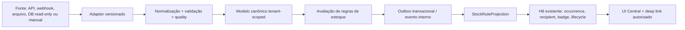

# Estado atual e mapa de arquitetura de Estoque

CURRENT_STATE_AS_OF=2026-08-23T17:51:15Z
BASELINE_SHA=a5a280c3ebc54741ced02a77d4da5ec51834d583
ARCHITECTURE_VERSION=E1-v1.0
DOCUMENT_STATUS=FINAL

## Identidade do checkpoint

- Tag: `saas-global-audit-pass-2026-08-23`; desreferência verificada no SHA da baseline.
- Worktree: `C:\Users\vande\crm-saas-frontend-stock-architecture-v1`.
- Branch: `architecture/stock-source-agnostic-v1`; limpa no preflight.
- `origin/master`, Vercel production, Railway API/worker e PostgreSQL oficial permanecem no checkpoint.
- PostgreSQL read-only: database `railway`, schema `public`, 11 migrations, última `20260823152000_add_distributed_rate_limit`, `RateLimitBucket` presente.
- Health/readiness: 200/200. Nenhuma mutation de runtime foi feita.

## CURRENT_RUNTIME

| Camada | Evidência | Classificação | Limite arquitetural |
|---|---|---|---|
| Navegação `/estoque` | `dashboardNavigation.ts`, `Dashboard.tsx` | PRODUCTION_ACTIVE (shell) | A tela é somente leitura. |
| `DashboardInventoryPanel` | `frontend/src/components/dashboard/DashboardInventoryPanel.tsx` | PRODUCTION_ACTIVE | Consulta `/hub/produtos`, pagina/filtro, mostra origem e possível stale. Não modela lote/validade. |
| `/hub/produtos` | `backend/src/integrations/routes.js` + `canonicalService.js` | PRODUCTION_ACTIVE | Lê `ProdutoExterno`/`EstoqueExterno`; não é o modelo canônico futuro. |
| Importação CSV/XLSX | `importService.js` e `/importacoes/*` | PRODUCTION_ACTIVE para dados de catálogo | Tem preview/validação/processamento, mas não contrato de lotes/validade nem capability manifest. |
| `Produto` | `backend/prisma/schema.prisma` | PRESENT_BUT_DISABLED para operações legadas | Não tem `empresaId` direto; não pode ser usado como estoque multi-tenant novo sem decisão/migração própria. |
| `MovimentacaoEstoque` e `/estoque/*` | schema/server | PRESENT_BUT_DISABLED | `legacyInventoryUnavailable` responde 410 até isolamento por empresa. Não reativar nesta missão. |
| `ProdutoExterno` | schema + Hub | PRODUCTION_ACTIVE | `empresaId` e `integracaoId` compostos; external ID é local à integração. Faltam mapping canônico e versionamento. |
| `EstoqueExterno` | schema + Hub | PRODUCTION_ACTIVE | Tem quantidade/reservado/disponível/local, mas não lote, validade, unidade semântica ou freshness completo. |
| Bling adapter | `blingService.js`, `BLING_INTEGRATION.md` | TEST_ONLY / fail-closed | Não é fonte de verdade nem dependência H8. Nenhuma ação Bling foi feita. |
| H8 | Central existente | PRODUCTION_ACTIVE | A futura camada deve projetar para a entidade/lifecycle H8, sem segunda Central. |

Contagens sanitizadas no binding oficial durante o preflight: `Produto=4`, `MovimentacaoEstoque=3`, `Integracao=3`, `ProdutoExterno=23`, `EstoqueExterno=22`, `ImportacaoDados=2`, configurações H8 habilitadas=1.

## HISTORICAL_STOCK_WORK

- Branch preservada: `archive/estoque-local-618a289`.
- Commit: `618a2895b53cb71e96b465a7a8da112cc82dc993` (`fix: estabilizar operacoes de estoque`).
- O branch também é apontado por `fix/estoque-audit` e pela `master` local histórica; não foi alterado.
- O submódulo legado `src/estoque` contém controller/service Nest de movimentação direta, entidade vazia e logs de payload/usuário. Isso é **DISCARD** como implementação e **REUSE_CONCEPT** somente para reconhecer os casos ENTRADA/SAIDA/AJUSTE.
- A mudança específica de 618a no painel corrigia seleção de preço promocional por janela de validade: **REUSE_CONCEPT** (teste de data), não código.
- `Produto`/`MovimentacaoEstoque` desse histórico não possuem o contrato tenant-safe necessário para o novo domínio: **DISCARD** como base estrutural.
- Não houve cherry-pick, merge ou cópia de código histórico.

## PROPOSED_ARCHITECTURE — fluxo canônico

### Fronteiras

1. A fonte somente fornece dados e capacidades; nunca dita o modelo H8.
2. O adapter não decide tenant pelo payload: `tenantId` vem da conexão autorizada.
3. O normalizador rejeita versão desconhecida, IDs ambíguos, quantidade sem unidade e validade com precisão falsa.
4. O modelo canônico preserva o último estado com freshness/confiança explícitas.
5. O motor de regras não lê payload bruto nem chama provider.
6. A única saída de alerta é uma projeção para H8; não haverá tabela, badge ou worker paralelo.

## Riscos atuais transformados em guardrails

- **Produto global legado:** nova entidade de estoque terá `empresaId` direto; link opcional ao produto legado só após prova de política global segura.
- **Estoque externo sem lote:** não inferir lotes ou validade; capability ausente bloqueia a regra correspondente.
- **Fonte stale:** não converter ausência/erro em quantidade zero; preservar último valor e marcar `STALE`/`UNKNOWN`.
- **Bling:** permanecer TEST_ONLY; adapter de referência será arquivo CSV sintético.
- **Rotas legadas 410:** não reativar e não considerar como API do novo domínio.
