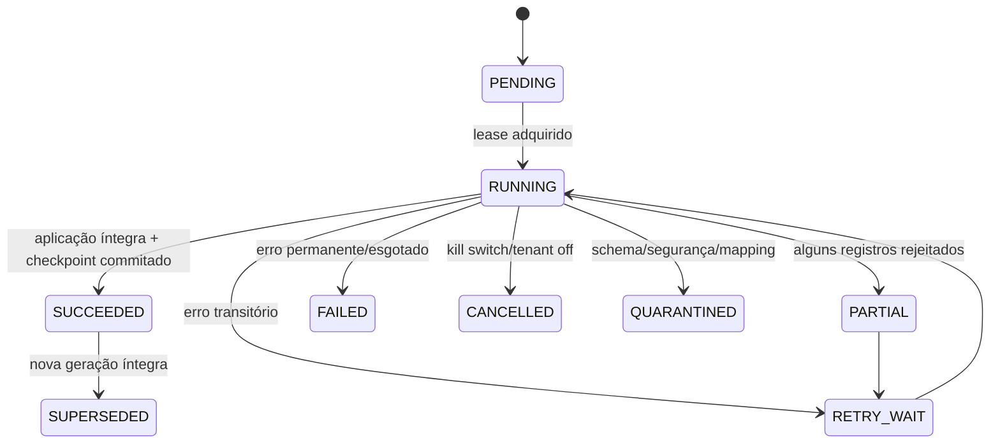

# Contrato de fontes, adapters e sincronização

CURRENT_STATE_AS_OF=2026-08-23T17:51:15Z
BASELINE_SHA=a5a280c3ebc54741ced02a77d4da5ec51834d583
ARCHITECTURE_VERSION=E1-v1.0
DOCUMENT_STATUS=FINAL

## Capability manifest

Cada adapter publica `schemaVersion` e um manifesto truthful com:

`FULL_SNAPSHOT`, `INCREMENTAL_CURSOR`, `WEBHOOK_EVENTS`, `PRODUCT_IDENTITY`, `SKU`, `BARCODE`, `LOT_IDENTIFIER`, `EXPIRATION_DATE`, `LOCATION`, `ON_HAND_QUANTITY`, `RESERVED_QUANTITY`, `AVAILABLE_QUANTITY`, `QUARANTINED_QUANTITY`, `UNIT_OF_MEASURE`, `SOURCE_UPDATED_AT`, `MOVEMENTS`, `TOMBSTONES`, `READ_ONLY_ACCESS`, `PAGINATION`, `RATE_LIMIT_METADATA`.

Regra não pode ser habilitada sem as capabilities necessárias. Sem validade não há alerta de vencimento; sem quantidade relevante não há resolução por quantidade; sem lote não se inventa lote.

| Regra | Capabilities necessárias | Fallback | Estado visível |
|---|---|---|---|
| `STOCK_LOT_EXPIRING` | `LOT_IDENTIFIER`, `EXPIRATION_DATE`, `ON_HAND_QUANTITY` ou `AVAILABLE_QUANTITY`, `UNIT_OF_MEASURE` | quality issue; não avaliar | “Fonte não suporta validade/quantidade” |
| `STOCK_LOT_EXPIRED` | mesmas de expiring + timezone/DATE | quality issue | “Validade não disponível” |
| `STOCK_DATA_STALE` | `SOURCE_UPDATED_AT` ou `lastSuccessfulSyncAt` | SLA da conexão, com confiança reduzida | “Fonte desatualizada” |
| `STOCK_SYNC_FAILED` | health, run status, correlation | sempre possível quando adapter executa | “Sincronização falhou” |

## Interface conceitual versionada

```text
describeCapabilities() -> CapabilityManifest
validateConfiguration(context) -> ValidationResult
testConnection(context) -> HealthResult
pullFullSnapshot(context) -> AsyncIterable<SourcePage>
pullChanges(context, cursor) -> AsyncIterable<SourcePage>
parseWebhook(context, payload) -> SourceEvent[]
normalizeRecord(context, sourceRecord) -> NormalizedRecord | Rejection
getNextCursor(page) -> Cursor | null
acknowledgeCheckpoint(context, cursor) -> AckResult
redactForLogs(value) -> SanitizedSummary
health(context) -> HealthResult
```

`context` contém `tenantId` resolvido server-side, `sourceConnectionId`, `correlationId`, `syncRunId`, cursor/checkpoint, `requestedAt`, deadline, actor/system actor e `schemaVersion`. Um adapter pode omitir métodos não suportados, mas o manifesto governa o fluxo.

`NormalizedRecord` contém `schemaVersion`, tenant/conexão, tipo e ID externo, versão/checksum, `sourceUpdatedAt`, `observedAt`, payload canônico, warnings, `dataQuality` e provenance. Não contém segredo, token, payload bruto sensível ou tenant vindo sem validação.

## Tipos de fonte

| Tipo | Atualização | Confiança/risco | Idempotência e desativação |
|---|---|---|---|
| `INTERNAL` | transação interna | alta; escopo controlado | revision/CAS; `DISABLED` preserva histórico |
| `GENERIC_API_PULL` | full/delta/paginação | depende de contrato/429 | cursor + source version; circuit breaker |
| `GENERIC_WEBHOOK_PUSH` | evento + reconciliação | replay/spoof | assinatura/event ID; webhook não prova completude |
| `DATABASE_READONLY` | query template | risco SSRF/SQL | allowlist, usuário read-only, cursor; kill switch |
| `FILE_IMPORT_CSV` | batch manual | determinístico; parser/fórmula | importBatch+row+checksum; preview/rollback lógico |
| `FILE_IMPORT_XLSX` | batch manual | maior risco de parser | limite/tamanho, fórmula neutralizada, quarentena |
| `MANUAL_CONTROLLED` | operador | baixa automação; auditável | actor+revision/CAS; nunca autoridade implícita |
| `VENDOR_SPECIFIC_ADAPTER` | conforme vendor | só após conformance | capability truthful; vendor isolado |

`REFERENCE_ADAPTER_RECOMMENDATION=FILE_IMPORT_CSV`. Ele é source-agnostic, exercita lote/validade/quantidade, aceita dataset sintético, não exige credencial/outbound e reproduz falhas/duplicatas de forma determinística. Bling não é referência.

## Lifecycle da conexão

`DRAFT → VALIDATING → ACTIVE → DEGRADED | AUTH_ERROR → DISABLED → ARCHIVED`. Desconectar impede syncs novos, preserva canonical state, provenance, auditoria e idempotency history; não resolve alertas automaticamente.

## SyncRun state machine



Campos: tenant, fonte, modo, timestamps, cursors before/after, contadores, warnings, error class, retry, correlation, lease e revision. Checkpoint só avança na mesma transação que aplica o lote. Falha após escrita parcial é repetível por checksum/version e CAS.

## Full, delta, webhook e arquivo

- Full snapshot declara `snapshotId/generation`; ausentes só viram tombstone após conclusão íntegra. Partial nunca apaga ausentes.
- Delta altera apenas registros explícitos; cursor é atômico e versões fora de ordem são rejeitadas/quarentenadas.
- Webhook valida assinatura/replay, resolve fonte pelo endpoint/conexão e agenda pull de reconciliação quando necessário.
- CSV/XLSX exige preview, schema, encoding/delimiter, limite de bytes/linhas, erro por linha, neutralização de fórmula e commit lógico do batch.
- Manual exige actor, role, revision/CAS e não sobrescreve autoridade sem política.

## Idempotência, retries e fairness

Chaves: `(fonte,sourceEventId)`, `(fonte,recordId,sourceVersion)`, `(importBatch,row,checksum)`, `(snapshot,recordId)`. Retries não duplicam; leases são por tenant/fonte; um tenant grande não monopoliza o worker. Timeout de conexão, request e lote são distintos; backoff exponencial com jitter, `Retry-After` respeitado, budget e quarantine para erro permanente. Não retry em credencial inválida, schema incompatível, tenant mismatch, assinatura inválida ou payload malicioso.
